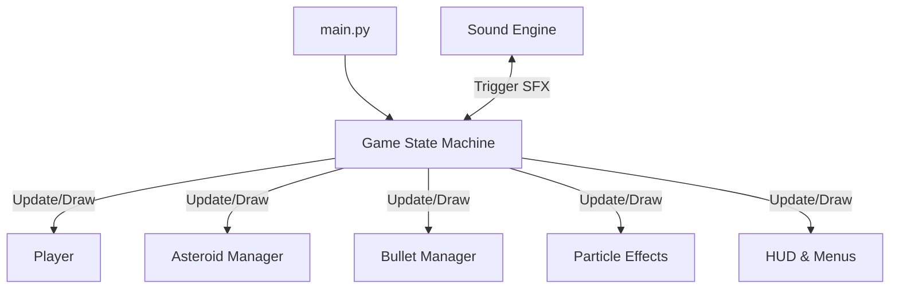

# 🚀 Space Shooter (Asteroids Procedural)

[](https://www.python.org/downloads/)
[](https://www.pygame.org/)
[](file:///Users/jefersoneduardoguido/VScodeProjects/space_shooter/docs/COST_AND_SCHEDULE.md)

A modern, high-performance remake of the classic *Asteroids* arcade game. Developed in **Python** using the **Pygame** engine, this project features entirely procedural graphics and sound generation—requiring zero external assets.

---

## 🎮 Features

- **Procedural Visuals**: Ships, asteroids, and particle effects are drawn in real-time using vector math.
- **Synthesized Audio**: Sound effects (lasers, explosions) are generated procedurally via **NumPy**, eliminating the need for `.wav` or `.mp3` files.
- **Dynamic Gameplay**: Progressive difficulty levels, wrap-around (toroidal) screen physics, and smooth WASD controls.
- **HUD & UI**: Real-time score tracking, life count, level progression, and 60 FPS performance.
- **Menus**: Pause menu (ESC) and Game Over screen with session recovery options.

---

## 🛠️ Tech Stack

| Layer | Technology |
|---|---|
| **Language** | Python 3.10+ |
| **Graphics Engine** | Pygame 2.x |
| **Audio Synthesis** | NumPy |
| **Packaging** | PyInstaller (for distribution) |

---

## 🚀 Quick Start

### 1. Prerequisites
Ensure you have Python 3.10 or higher installed.

### 2. Installation
Clone the repository and install the dependencies:
```bash
# Clone the repository
git clone https://github.com/Bradoqguido/Game_SpaceShooter.git
cd Game_SpaceShooter

# Install dependencies
pip install -r requirements.txt
```

### 3. Run the Game
```bash
python main.py
```

---

## 🏗️ Architecture Overview

The system follows a clean modular design with a dedicated state machine for game flow.



For more details, see [docs/ARCHITECTURE.md](file:///Users/jefersoneduardoguido/VScodeProjects/space_shooter/docs/ARCHITECTURE.md).

---

## 📁 Repository Structure

```
space_shooter/
├── main.py              # Entry point & Game Loop
├── REQUIREMENTS.md      # Business stories & backlog
├── requirements.txt     # Dependencies
├── docs/                # Technical documentation
└── src/                 # Game logic & entity modules
```

---

## 🦾 Contributing

Follow our coding standards:
1. **Indentation**: 2 spaces.
2. **Naming**: Use `I` prefix for Interfaces/Protocols and `T` for specific Types.
3. **Safety**: Use strict equality (`===` not applicable in Python, but follow PEP8 + type hints).
